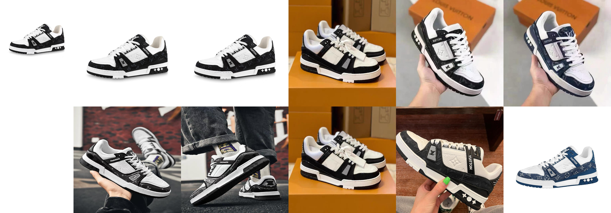
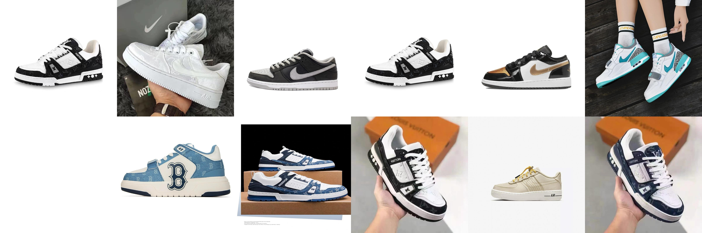
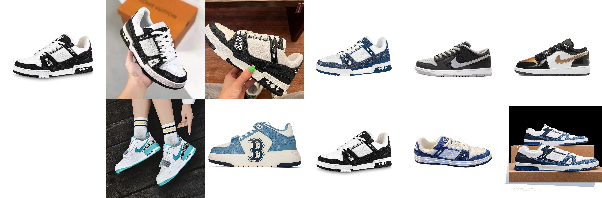

[**中文说明**](distillation.md) | [**English**](distillation_En.md)

# 使用知识蒸馏提升Chinese-CLIP图像检索能力

本文档提供了一个结合ModelScope模型库，支持Chinese-CLIP利用知识蒸馏的方法进行微调训练的示例。通过知识蒸馏的功能，可以使用大模型（如较大规模版本的Chinese-CLIP或其他ModelScope支持的图像表征模型）蒸馏较小规模Chinese-CLIP，进一步提升Chinese-CLIP的图像检索（图到图召回）能力。使用的Teacher model由[ModelScope](https://github.com/modelscope/modelscope)提供，Chinese-CLIP全系列目前均已上线ModelScope。

## 环境准备

+ **Turing**、**Ampere**、**Ada**、**Hopper**架构的Nvidia GPU显卡（如H100、A100、RTX 3090、T4、RTX 2080），Nvidia各架构对应显卡型号可参见[此文档表格](https://en.wikipedia.org/wiki/CUDA#GPUs_supported)。
+ CUDA 11.4及以上版本。
+ Pytorch 1.12及以上版本。
+ [requirements.txt](requirements.txt)要求的其他依赖项
+ **ModelScope**：通过执行`pip install modelscope`安装ModelScope。

## 在Chinese-CLIP中用起来！

在Chinese-CLIP finetune中对于图像端应用知识蒸馏并不复杂。只需要在finetune的sh脚本中加入`--distllation`配置项。
然后在配置项`--teacher-model-name`填入所要使用的Teacher model名称。现在支持的Teacher model包括以下四种。
<table border="1" width="120%">
    <tr align="center">
        <td><b>Teacher model</b></td><td><b>模型介绍</b></td>
    </tr>  
	<tr align="center">
        <td>damo/multi-modal_clip-vit-huge-patch14_zh</td><td><a href="https://www.modelscope.cn/models/damo/multi-modal_clip-vit-huge-patch14_zh/summary">CLIP模型-中文-通用领域-huge</a></td>
    </tr>
	<tr align="center">
        <td>damo/multi-modal_clip-vit-large-patch14_zh</td><td><a href="https://www.modelscope.cn/models/damo/multi-modal_clip-vit-large-patch14_zh/summary">CLIP模型-中文-通用领域-large</a></td>
    </tr>	    
    </tr>
	<tr align="center">
        <td>damo/multi-modal_team-vit-large-patch14_multi-modal-similarity</td><td><a href="https://www.modelscope.cn/models/damo/multi-modal_team-vit-large-patch14_multi-modal-similarity/summary">TEAM图文检索模型-中文-large</a></td>
    </tr>  
	<tr align="center">
        <td>damo/multi-modal_rleg-vit-large-patch14</td><td><a href="https://www.modelscope.cn/models/damo/multi-modal_rleg-vit-large-patch14/summary">RLEG生成式多模态表征模型-英文-large</a></td>
</table>
 

最后在配置项`--kd_loss_weight`填入蒸馏损失的权值，默认值是0.5。

其中各配置项定义如下：
+ `distllation`: 是否启用知识蒸馏微调模型图像端。
+ `teacher-model-name`: 指定使用的Teacher model。目前支持以上四个Teacher model，如填入`damo/multi-modal_team-vit-large-patch14_multi-modal-similarity`。
+ `kd_loss_weight`（可选）: 蒸馏损失的权值，默认值是0.5。

我们提供了样例脚本`run_scripts/muge_finetune_vit-b-16_rbt-base_distllation.sh`，使用的是`TEAM图文检索模型-中文-large`作为Teacher model。

## 效果验证
这里是我们模型(finetune+distillation) vs 预训练模型 vs finetune模型的图像检索Top10结果。左上角图像作为query，右边按顺序Top1到Top10检索结果。本次实验的support数据集有10万电商数据量（包括鞋子、衣服、裤子等物品）。

我们方法的优势：
+ 符合检索任务基本要求：在保证了类目相似性的前提下，很好实现了图像相似性。
+ 性能好且速度快：通过蒸馏的方法，使得base模型有着large模型类似的检索效果。并且部署到CPU，检索推理时间控制在了100ms以内。

     
     
     

## 快速体验
相关解决方案已经上线阿里云[PAI-DSW Gallery](https://gallery.pai-ml.com/#/preview/deepLearning/cv/cn_clip_distillation)。在PAI-DSW Gallery提供对应的Notebook，支持用户利用自有数据构建专属搜索模型。
